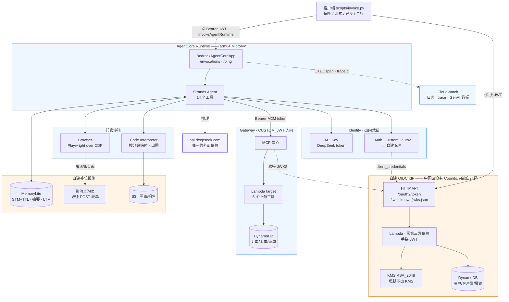
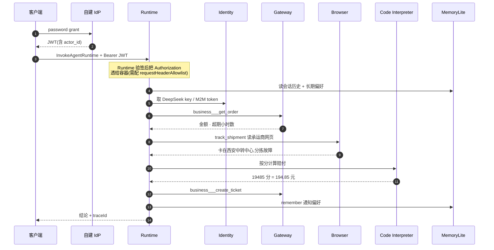

# agentcore-cn

Amazon Bedrock AgentCore 中国区(cn-northwest-1 宁夏)全能力 demo。

模型走 DeepSeek 官方 API,鉴权自建(Lambda + DynamoDB + KMS 迷你 OIDC IdP),
基础设施全部 CloudFormation,除 `api.deepseek.com` 外没有任何外部服务依赖。

## 架构



橙色框是**因为中国区能力缺失而自建的部分**:没有 Cognito 所以自己起 OIDC issuer,
没有 AgentCore Memory 所以用 DynamoDB 补一个 MemoryLite,物流查询页是 Browser
的演示靶子。蓝色框是 AgentCore 原生能力。紫色是唯一的外部依赖。

一次完整调用的时序:



## 中国区可用能力边界

公告:https://docs.amazonaws.cn/en_us/aws/latest/userguide/bedrock-agentcore.html

可用:`Runtime` `Gateway` `Identity` `Code Interpreter` `Browser` `Observability`

不可用:`Memory` `Policy` `Harness` `Payments` `Knowledge Bases` `Evaluations`
`Optimizations` `Registry`

其他中国区差异(已在本项目设计中规避):

- Runtime 仅支持 MicroVM capacity provider,不支持 Managed EC2
- Runtime / Gateway 均不支持 Amazon Cognito 入向鉴权(且 Cognito 在宁夏区本就不可用)
- Gateway 不支持 "No authorization" 入向,必须 `CUSTOM_JWT` 或 `AWS_IAM`
- Gateway 无语义检索(semantic tool discovery),工具靠 description 显式列举
- Gateway 无 Inference targets / Gateway rules / WAF 集成 / 连接器目录
- Identity 无 Private IdP,内置 OAuth provider(GitHub/Google/...)均不可用
- Tools 不支持 S3 Files 形式的 BYO 文件系统;Browser 无 Web Bot Auth
- ARN 分区是 `aws-cn`,不是 `aws`

## 能力覆盖矩阵

| 能力 | demo 实现 | 位置 |
| --- | --- | --- |
| Runtime 基础 | arm64 容器,`/invocations` + `/ping` | `src/agent/main.py` |
| Runtime 流式 | SSE 逐 token 返回 | `src/agent/main.py` |
| Runtime 异步长任务 | 后台任务 + `/ping` 返回 `HealthyBusy` | `src/agent/main.py` |
| Runtime 会话隔离 | 同 actor 多 sessionId 互不串话 | `src/agent/memory_lite.py` |
| Runtime 版本/端点 | 发布多版本 + 命名 endpoint 灰度 | `scripts/create_runtime.py` |
| Gateway(Lambda target) | 订单 / 工单 / 赔付政策,5 个工具 | `src/lambdas/tools/` |
| Gateway 入向鉴权 | 自建 IdP 的 `CUSTOM_JWT` | `infra/10-auth-idp.yaml` |
| Identity 出向 API Key | DeepSeek token 存 credential provider | `scripts/setup_identity.py` |
| Identity 出向 OAuth2 | 自建 IdP 的 `client_credentials`(CustomOauth2) | `scripts/setup_identity.py` |
| Identity 入向 JWT | 自建 IdP 签 RS256,JWKS 公开 | `src/lambdas/idp/` |
| Code Interpreter | 赔付计算 + 出图传 S3 | `src/agent/tools/code_interp.py` |
| Browser | Playwright over CDP 填表抓自建物流页 | `src/agent/tools/browser.py` |
| Observability | 自定义 span 埋点 + GenAI 看板 | `src/agent/obs.py` |
| 全能力自检 | `mode=selftest` 依次点亮 8 项并出报告 | `src/agent/selftest.py` |
| Memory(缺失补位) | MemoryLite:STM 带 TTL / 会话摘要 / LTM | `src/agent/memory_lite.py` |

### MemoryLite 的设计取舍

中国区没有 AgentCore Memory,这一块整个是自建的,单表三类条目:

```
STM   PK=SESSION#<session_id>   SK=MSG#<12位零填充序号>   带 TTL
摘要  PK=SESSION#<session_id>   SK=SUMMARY                带 TTL
LTM   PK=ACTOR#<actor_id>       SK=FACT#<key>             无 TTL
```

几个不显然但必要的决定:

- **排序键用零填充序号而不是时间戳。** 同一秒写多条会撞键,而且字典序必须
  等于时间序,`Query` 才能直接按顺序取回。
- **窗口按"轮"计,底层取 2 倍条数。** 按条数理解会让实际上下文只有一半。
- **返回的历史保证以 `user` 消息开头。** 窗口边界或 TTL 过期都可能让开头
  变成 `assistant`,部分 OpenAI 兼容端点收到这种历史会直接 400。
- **读取时再过滤一次过期。** DynamoDB 的 TTL 清理最长延迟 48 小时。
- **超窗口的历史压成摘要而不是丢掉**,否则长会话会突然"失忆"。摘要是滚动的,
  上一版会作为输入折进下一版。
- **长期记忆有条数和长度上限。** 不设上限的话模型会把整段对话当"偏好"写进去。
- **`get_facts` 分页拉完。** `Query` 单次最多返回 1MB,不翻页会静默丢数据,
  症状是"用户偏好时有时无"。

## 目录

```
infra/       CloudFormation 模板(分层,按序部署)
  00-foundation.yaml     DynamoDB / S3 / ECR / IAM
  10-auth-idp.yaml       自建 OIDC IdP(KMS + Lambda + HTTP API)
  20-business-tools.yaml Gateway 的 Lambda target
  30-logistics-web.yaml  Browser 的演示靶子(公开的物流查询页)
src/agent/   Runtime 容器内的 Agent
src/lambdas/ idp / tools / logistics 三个 Lambda(入口文件名各不相同,
             否则测试和脚本里 import 会互相覆盖)
scripts/     部署与控制面脚本
  deploy.sh              建栈 / 推 Lambda 代码 / seed / Identity / Gateway / Runtime
  build_push.sh          构建 arm64 镜像推 ECR
  create_runtime.py      建 Runtime + 版本与命名端点(灰度)
  create_gateway.py      建 Gateway + Lambda target
  setup_identity.py      配出向凭证(DeepSeek key + 自建 IdP 的 OAuth2)
  invoke.py              调用客户端(同步 / 流式 / 异步 / 自检)
  demo.sh                按顺序点亮八项能力的演示脚本
  naming.py              客户端 ID 与 scope 约定的唯一来源
tests/       本地单元测试(不需要 AWS 凭证)
```

## 测试

```
pytest tests/                                  # 521 个用例,不需要 AWS 凭证
cfn-lint infra/*.yaml --region cn-northwest-1   # 模板离线校验
```

测试里没有 mock 掉核心逻辑:DynamoDB 用支持 `begins_with` / GSI / 分页 /
条件写的内存假实现,RSA 是纯 Python 实现(见 `tests/rsa_stub.py`),
Gateway / Identity 的请求参数用 botocore 的 `ParamValidator` 按真实服务模型校验,
OTEL 埋点用真实 SDK + `InMemorySpanExporter` 断言 span 和属性。

## 部署后自检

```
aws bedrock-agentcore invoke-agent-runtime ... --payload '{"mode":"selftest"}'
```

依次探测 8 项(Runtime / Observability / MemoryLite / Identity / 模型 /
Gateway / Code Interpreter / Browser),**一项失败不影响后面的步骤** ——
一次跑完看全景,而不是在第一个错误处停下。报告同时写 S3 并返回预签名链接。

「没配置」和「坏了」在报告里是两种状态(`skipped` / `failed`),
否则分阶段部署时报告会全是红的。

### Observability 的分工

Strands 已经按 GenAI 语义约定发了 agent / model / tool 三层 span
(`gen_ai.operation.name`、`gen_ai.usage.*_tokens`、`gen_ai.tool.name`),
CloudWatch GenAI 看板直接能用。`src/agent/obs.py` 只补 Strands 看不到的部分:
MemoryLite 读写、Gateway 取 token、沙箱与浏览器会话启动、selftest 各步骤,
属性统一挂在 `acn.*` 命名空间下。

两条硬规则:

- **埋点绝不能让业务失败。** 拿不到 tracer、provider 挂了,全部退化成空操作。
- **不往 span 里写敏感内容。** 只记长度、条数、耗时、成败。
  异常也只记类型不记 message —— 所以显式传了 `record_exception=False`,
  OTEL 的默认行为会把异常消息(里面常有订单号、用户原话)记成 span event。

## 快速开始

```bash
python3.13 -m venv .venv && .venv/bin/pip install -r requirements.txt -r requirements-dev.txt
cp .env.example .env          # 填 AWS_PROFILE 和 DEEPSEEK_API_KEY
./scripts/deploy.sh           # 基础设施 + IdP + 工具 + Gateway
# 把输出里的 GATEWAY_URL 和 m2m secret 填回 .env,然后
./scripts/deploy.sh --identity
./scripts/deploy.sh --runtime
python scripts/invoke.py --selftest
./scripts/demo.sh             # 完整演示;--auto 不等回车、--list 只看大纲
```

**已在真实账号验证**:cn-northwest-1 上自检 8/8 通过(20 秒),
完整业务链路 25 秒 —— 模型自主完成查订单 → Browser 读物流页 →
沙箱按分算赔付 → 开工单 → 记住偏好。踩过的坑见 `docs/DEPLOY.md`。

完整步骤、分阶段验证清单、以及**必须在真实账号里确认的 8 项**见
`docs/DEPLOY.md`。

## 部署前须知

这是一个 demo,有几处设计是为了演示效果而刻意做的,直接拿去生产前必须改:

- **物流查询页(`infra/30-logistics-web.yaml`)是公开端点,没有鉴权。**
  它扮演第三方承运商的公开查询页 —— 加鉴权会让 Browser 演示失真。
  已有的约束是:数据全是 `seed_business.py` 写入的合成数据、运单号严格正则校验、
  HTTP API 限流 20 rps、所有输出经 `html.escape`。要改成非公开,
  给 HTTP API 挂一个 Lambda authorizer 即可,但那样 Browser 演示需要额外处理登录态。
- **业务工具 Lambda 不做按用户的数据隔离。** 它把 Gateway 当可信调用方,
  任何通过 `CUSTOM_JWT` 的调用方都能查任何订单。生产需要给 target 配
  `JWT_PASSTHROUGH` 凭证类型 + `metadataConfiguration.allowedRequestHeaders`
  把 `Authorization` 透进 Lambda,再解 `actor_id` 过滤。
- **所有 CloudFormation 资源都是 `DeletionPolicy: Delete`**(S3 桶带
  `EmptyOnDelete`),删栈会连数据一起删。生产请改 `Retain`。
- **IdP 是最小可用实现。** 没有 MFA、没有密码复杂度策略、没有登录失败锁定,
  `/oauth2/authorize` 是个返回 400 的桩(只支持 `password` /
  `client_credentials` / `refresh_token` 三种 grant)。

数据方面:仓库里没有任何真实凭证。`seed_business.py` 生成的订单、运单、
工单全部是合成数据,`.env.example` 里的密码/密钥字段一律留空。
